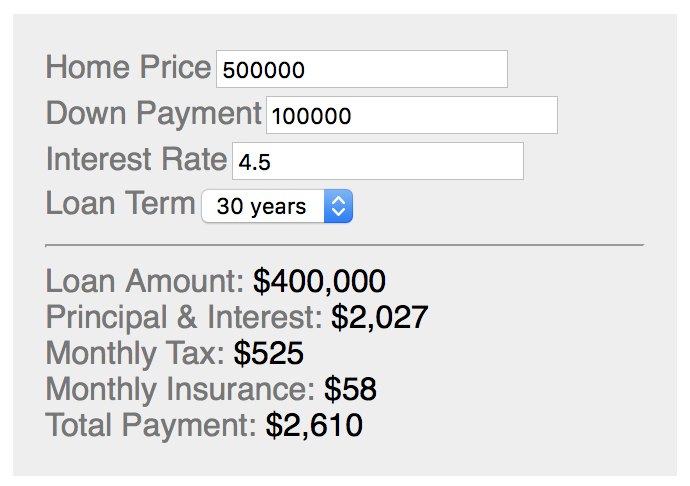

# Mortgage Calculator React

A simple mortgage calculator as a React component.

## Sample App

You can try out the mortgage calculator. Run the following command to start the sample app.

    npm start

Then open http://localhost:8080 in your browser. If port 8080 is already in-use, the dev server may start on a different port. Look for the following log output: "Project is running at" to determine the correct port.

## Usage in Your App

You can include the mortgage calculator in your app as a React component.

    import MortgageCalculator from "mortgage-calculator-react";
    
    const reactElement = (
        

            <MortgageCalculator/>
        

    );

